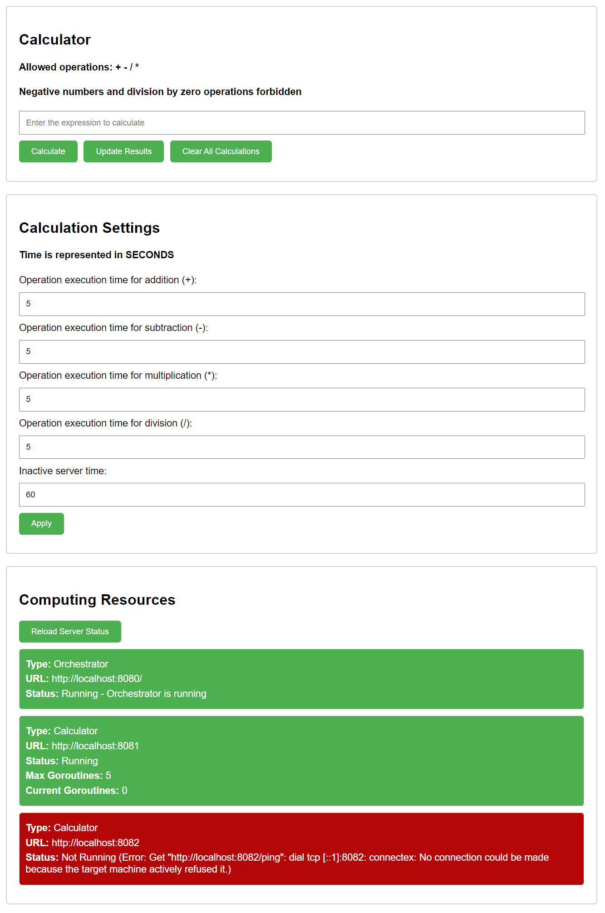

# Проект golang-calculator

# Проект golang-calculator

## Оглавление

- [Структура проекта](#структура-проекта)
- [Предварительные требования](#предварительные-требования)
- [Начало работы](#начало-работы)
  - [Копирование проекта с GitHub](#копирование-проекта-с-github)
  - [Установка зависимостей](#установка-зависимостей)
  - [Настройка конфигурации базы данных](#настройка-конфигурации-базы-данных)
- [Инструкция по запуску](#инструкция-по-запуску)
  - [Frontend интерфейс - запуск](#frontend-интерфейс---запуск)
  - [Сервер orchestrator - запуск](#сервер-orchestrator---запуск)
  - [Сервер calculator - запуск](#сервер-calculator---запуск)
- [Описание методов](#описание-методов)
  - [Описание методов orchestrator](#описание-методов-orchestrator)
  - [Описание методов calculator](#описание-методов-calculator)
  - [Описание методов Frontend](#описание-методов-frontend)
- [Контроль и отработка в случае внезапного прекращения работы одного из серверов](#контроль-и-отработка-в-случае-внезапного-прекращения-работы-одного-из-серверов)
- [Обновление проекта](#обновление-проекта)
  - [Регистрация пользователей](#регистрация-пользователей)
  - [Интеграционные и модульные тесты](#интеграционные-и-модульные-тесты)
  - [Переход на grpc](#gереход-на-grpc)

---


## Структура проекта

Этот проект структурирован в две основные директории: `backend` и `frontend`, каждая из которых содержит компоненты для соответствующей части приложения.

```css
golang-calculator
│
├── backend
│ ├── calculator1
│ │ └── main.go
│ ├── calculator2
│ │ └── main.go
│ ├── orchestrator
│ │ └── main.go
│ └── utility
│ ├── calculation
│ │ └── calculation.go
│ ├── database
│ │ └── database.go
│ └── models
│ └── calculations.go
│
├── frontend
│ ├── index.html
│ ├── script.js
│ └── styles.css
│
├── go.mod
├── go.sum
└── README.md
```

## Backend

Директория backend содержит логику для API и калькуляторов.

### calculator1 & calculator2

Эти папки содержат экземпляры сервисов калькулятора. Каждая имеет файл `main.go`, который содержит серверную логику обработки запросов на вычисления.

### orchestrator

Эта папка содержит сервис оркестратора в файле `main.go`, который управляет распределением задач на вычисления между экземплярами калькулятора и выступает в качестве API для frontend.

### utility

Содержит общие вспомогательные компоненты:

- `calculation`: Функции для обработки арифметических операций.
- `database`: Функции для настройки базы данных, подключения и операций с ней.
- `models`: Структуры данных, используемые во всем приложении.

## Frontend

Директория frontend предоставляет пользовательский интерфейс для взаимодействия с API калькулятора.

- `index.html`: Основной HTML-документ.
- `script.js`: Содержит JavaScript код для обработки пользовательских взаимодействий и запросов к API.
- `styles.css`: Стилевой файл для настройки внешнего вида frontend.

## Файлы Конфигурации

- `go.mod` и `go.sum`: Определяют зависимости проекта и конфигурацию модуля.

---


## Предварительные требования

Перед началом работы с проектом необходимо убедиться, что на вашем компьютере установлены следующие инструменты и компоненты:

- **Go (версия 1.22.0 или выше)**: Язык программирования Go необходим для разработки и запуска серверной части приложения. Вы можете скачать его с официального сайта [golang.org](https://golang.org/dl/).
- **PostgreSQL**: Система управления базами данных, которая используется в проекте для хранения и обработки данных. Установка PostgreSQL доступна на официальном сайте [postgresql.org](https://www.postgresql.org/download/).
- **Git**: Система контроля версий, необходимая для клонирования проекта из репозитория на GitHub. Скачать Git можно с сайта [git-scm.com](https://git-scm.com/downloads).

Убедитесь, что все эти компоненты установлены и правильно настроены на вашем компьютере перед продолжением работы с проектом.

---


## Начало работы


### Копирование проекта с GitHub

Для начала работы с проектом необходимо клонировать репозиторий на локальный компьютер, используя следующую команду в терминале:
```git clone https://github.com/ecspecial/golang-calculator.git```

После клонирования репозитория, перейдите в папку проекта для выполнения последующих команд.


### Установка зависимостей

Чтобы установить все зависимости проекта, перейдите в директорию проекта, откройте в ней терминал и выполните команду:
```go mod tidy```

Эта команда скачает и установит все необходимые зависимости, указанные в файле `go.mod`.


### Настройка конфигурации базы данных

Перед началом работы с приложением необходимо настроить параметры подключения к базе данных. Для этого перейдите в файл конфигурации базы данных:

[`backend/utility/database/database.go`](./backend/utility/database/database.go)

В этом файле необходимо изменить следующие параметры на значения, соответствующие вашей конфигурации базы данных:

```go
// Параметры подключения к базе данных
const (
    host     = "localhost"    // Адрес сервера базы данных
    port     = 5432           // Порт сервера базы данных
    user     = "postgres"     // Имя пользователя базы данных
    password = "123QWEasdf"   // Пароль пользователя базы данных
    dbname   = "postgres"     // Название базы данных
)
```

Убедитесь, что база данных запущена и параметры в файле database.go соответствуют вашей конфигурации.

---


## Инструкция по запуску

Для запуска приложения golang-calculator необходимо выполнить следующие шаги:

### Frontend интерфейс - запуск

Для запуска пользовательского интерфейса откройте файл [`frontend/index.html`](./frontend/index.html) в браузере.
Это можно сделать нажав правой кнопкой мыши по файлу и выбрать "Открыть в браузере"

### Сервер orchestrator - запуск

Для запуска сервера orchestrator откройте терминал в директории `backend` и выполните следующую команду:
```go run ./orchestrator/main.go```

### Сервер calculator - запуск

Для запуска сервера calculator1 откройте новое терминальное окно в директории `backend` и выполните команду:
```go run ./calculator1/main.go```

(Опционально) Для запуска сервера calculator2 откройте ещё одно терминальное окно и выполните команду:
```go run ./calculator2/main.go```

После успешного запуска всех компонентов система будет готова к использованию через интерфейс, запущенный в браузере.

---


## Описание методов

### Описание методов orchestrator

Сервер orchestrator управляет распределением задач между различными экземплярами калькулятора и предоставляет API для взаимодействия с frontend. Ниже приведены основные методы API и примеры их использования с помощью `curl`.

#### Получение статуса оркестратора

```bash
curl -X GET http://localhost:8080/orchestrator-status```

Пример ответа сервера:
```json
{
  "running": true,
  "message": "Orchestrator is running"
}
```

#### Получение статусов серверов калькулятора

```bash
curl -X GET http://localhost:8080/ping-servers
```

Пример ответа сервера:
```json
[
  {
    "url": "http://localhost:8081",
    "running": true,
    "maxGoroutines": 5,
    "currentGoroutines": 2
  },
  {
    "url": "http://localhost:8082",
    "running": false,
    "error": "Connection refused"
  }
]
```

#### Отправка запроса на калькуляцию
```bash
curl -X POST http://localhost:8080/submit-calculation -H "Content-Type: application/json" -d '{
  "userId": "1",
  "operation": "2+2",
  "add_duration": 1,
  "subtract_duration": 1,
  "multiply_duration": 1,
  "divide_duration": 1,
  "inactive_server_time": 10
}'
```

Пример ответа сервера:
```json
{
  "id": 123,
  "userId": 1,
  "status": "created",
  "operation": "2+2"
}
```

#### Получение результата калькуляции по ID
```bash
curl -X GET http://localhost:8080/get-calculation-result?id=123
```

Пример ответа сервера:
```json
{
  "id": 123,
  "userId": 1,
  "result": 4,
  "status": "completed"
}
```

#### Очистка всех калькуляций
```bash
curl -X POST http://localhost:8080/clear-all-calculations
```

Пример ответа сервера:
```plaintext
All calculations have been cleared successfully.
```

### Описание методов calculator

Серверы калькулятора обрабатывают вычислительные задачи, отправленные оркестратором. Они предоставляют API для приема и выполнения вычислений.

#### Запуск вычисления

Для отправки вычислительной задачи на сервер калькулятора, используйте следующий `curl` запрос:

```bash
curl -X POST http://localhost:8081/calculate -H "Content-Type: application/json" -d '{
    "id": 1,
    "userId": "1",
    "operation": "2+2",
    "times": {
        "add_duration": 1,
        "subtract_duration": 1,
        "multiply_duration": 1,
        "divide_duration": 1
    }
}'
```

Пример ответа сервера:
```json
{
  "message": "Calculation started successfully."
}
```

#### Получение текущего количества горутин
```bash
curl -X GET http://localhost:8081/goroutines
```

Пример ответа сервера:
```plaintext
Current number of goroutines: 1
```

#### Проверка состояния сервера калькулятора
```bash
curl -X GET http://localhost:8081/ping
```

Пример ответа сервера:
```json
{
  "status": "running",
  "maxGoroutines": 5,
  "currentGoroutines": 1
}
```

#### Остановка сервера калькулятора
```bash
curl -X POST http://localhost:8081/shutdown
```

Пример ответа сервера:
```plaintext
Server is shutting down...
```

Эти примеры curl команд позволяют взаимодействовать с сервером калькулятора для отправки вычислений, мониторинга ресурсов и управления состоянием сервера.

### Описание методов Frontend

Как взаимодействовать с пользовательским интерфейсом и его функциями.


1. Секция Calculator отвечает за ввод операций.
- Отправление кнопки происходит с нажатием кнопки `Calculate`
- Отправленные на решение операции автоматически обновляются каждую минуту или по нажатию на кнопку `Update Results`
- Очистка всех операций из базы данных происходит с нажатием кнопки `Clear All Calculations`

2. Секция Calculation Settings отвечает за время операций и отображения ошибочных уведомлений от сервера
- Применение параметров происходит с нажатием кнопки `Apply`

3. Секция Computing Resources для отслеживания воркеров
- Первоначальный статус загружается вместе с загрузкой страницы
- Последующее получение статусов происходит с нажатием кнопки `Reload Server Status`
- ошибочные уведомления исчезают через указанное в секции Calculation время

---


## Контроль и отработка в случае внезапного прекращения работы одного из серверов

В случае внезапного прекращения работы одного из серверов, система имеет встроенный механизм для обнаружения и перезапуска неоконченных задач. Это достигается за счет функции `checkAndRestartFailedOperations` в [`backend/orchestrator/main.go`](./backend/orchestrator/main.go), которая регулярно проверяет состояние вычислительных задач и перезапускает те, которые не были завершены в ожидаемое время.

Функция `checkAndRestartFailedOperations` выполняется в отдельной горутине и запускается каждую минуту. Она сканирует таблицу базы данных на предмет записей с состоянием 'work', которые превысили ожидаемое время выполнения. Для каждой такой записи функция сбрасывает статус на 'created' и обнуляет время начала, позволяя системе повторно попытаться выполнить задачу.

Пример работы функции:

1. Функция `checkAndRestartFailedOperations` запускается и запрашивает записи со статусом 'work'.
2. Для каждой найденной записи рассчитывается общее ожидаемое время выполнения на основе указанного в ней времени выполнения операций.
3. Если текущее время превышает ожидаемое время завершения задачи, функция обновляет запись, сбрасывая статус на 'created'.
4. Обновленные записи становятся доступными для новых попыток обработки серверами калькуляторов.

Этот механизм обеспечивает устойчивость системы к сбоям и гарантирует, что все задачи будут выполнены, даже если один из серверов внезапно прекратит работу.

## Обновление проекта

### Регистрация пользователей

Были созданы новые функции регистрации пользователей, аутентификации и создания токенов JWT, реализованные в проекте. 

## Регистрация новых пользователей

Метод `/api/v1/register` предназначен для регистрации новых пользователей в системе. Пользователь отправляет свои учетные данные (логин и пароль), которые записываются в базу данных после хэширования пароля.

### Пример запроса на регистрацию:

```http
POST /api/v1/register
Content-Type: application/json

{
    "login": "user_login",
    "password": "user_password"
}
```

Ответ сервера:
Успешная регистрация возвращает подтверждение с `success: true`. В случае ошибки сервер возвращает сообщение об ошибке с соответствующим статусом HTTP.

##  Аутентификация пользователя и создание JWT
Метод `/api/v1/login` используется для аутентификации пользователя в системе. После проверки учетных данных пользователя, если данные верны, создается JWT (JSON Web Token), который возвращается пользователю. Этот токен используется для аутентификации запросов пользователя в других частях системы.

Пример запроса на аутентификацию:

```http
POST /api/v1/login
Content-Type: application/json

{
    "login": "user_login",
    "password": "user_password"
}
```

Ответ сервера:
При успешной аутентификации сервер возвращает JWT в ответе. В случае неправильного пароля или несуществующего логина возвращается ошибка с описанием проблемы.


### Интеграционные и модульные тесты

В данном обновлении были добавлены интеграционные и модульные тесты для оркестратора и калькуляторов.

1. Тесты калькулятора можно запустить командой ```go test``` из папки [`backend/calculator1`](backend/calculator1)

- В этих тестах смешаны модульное и интеграционное тестирование. Функция `TestConvertOperationTimes` тестирует преобразование времени операций, что является скорее модульным тестированием. С другой стороны, `TestCalculateEndpoint`, `TestGoroutinesEndpoint` и `TestShutdownEndpoint` проверяют обработчики HTTP, включающие взаимодействие между различными компонентами системы, что делает их интеграционными тестами.

2. Тесты оркестратора можно запустить командой ```go test``` из папки [`backend/orchestrator`](backend/orchestrator)

- Этот файл содержит тесты для программы, которая взаимодействует с внешними серверами и базой данных. `TestPingServers` Этот тест проверяет функцию pingServers, которая отправляет запрос на сервер и возвращает его статус. Создается мок-сервер, который имитирует настоящий сервер расчетов. Затем вызывается функция pingServers, и проверяется, что полученный статус корректен. `TestSubmitCalculations`
Этот тест проверяет функцию submitCalculations, которая отправляет вычисления на сервер. Создается мок-сервер для обработки запросов. Далее функция submitCalculations вызывается, и проверяется, что запросы отправлены корректно и все ожидания выполнены.


### Переход на grpc

В этом обновлении было заменено использование HTTP-запросов на gRPC для взаимодействия между оркестратором и калькулятором. Это изменение позволяет повысить производительность и надежность нашего сервиса.

### Оркестратор

Оркестратор [`backend/orchestrator/main.go`](backend/orchestrator/main.go) теперь использует gRPC для отправки вычислений на калькуляторы. Ниже представлена функция `submitCalculations`, которая отправляет задачи на доступные серверы калькуляторов:

### Калькулятор

Сервер калькулятора теперь также работает через gRPC. Функция PerformCalculation, которая обрабатывает запросы от оркестратора переведена на протокол gRPC. Файл [`backend/calculator1/main.go`](backend/calculator1/main.go)